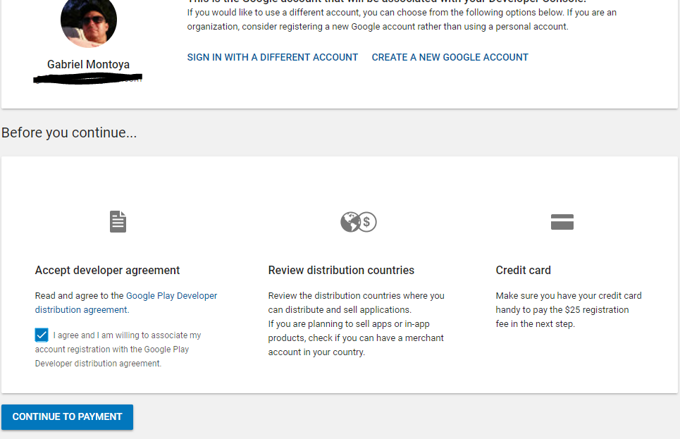
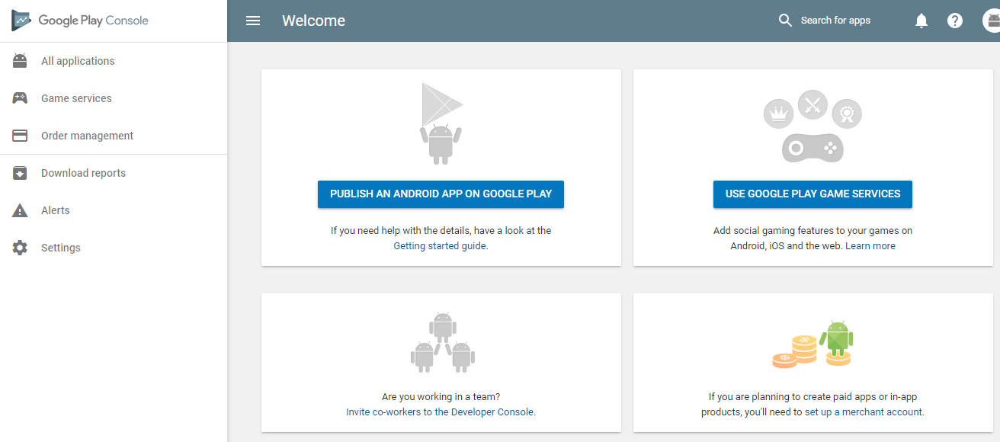

# How to Publish Android Applications

The publishing process can be categorized into 3 phases

* Preparation for Release
* Distribution to Users
* Engagement and Growth of your Userbase  

Each of these phases is just as important as the development of the app itself. To make sure your app shines in Google Play, and increase the chances that users will download it, let's review Google's [Launch Checklist](https://classroom.udacity.com/nanodegrees/nd801/parts/3be77470-96de-400a-bbfb-2ae4cc924d48/modules/6cb81da9-d083-4721-a31b-4f435de9fedd/lessons/e8a12d52-65b1-4f20-9fe4-5622c992631f/concepts/3908d2b5-4a8a-4760-a459-9304ad6ac3bd), which summarizes tasks to complete before publishing your app on Google Play.  

## Register the Account

Throughout the publishing process, we use the [Google Play Developer Console](https://developer.android.com/distribute/console/index.html). It’s your one-stop shop for managing your app’s life-cycle, from pre-launch testing to tracking your app’s acquisition stats and revenue reports afterwards.

1.  Sign in with a Google account.
2.  Read and agree to the Google Play Developer distribution agreement
3.  Double-check the country where you're planning to distribute is listed
4.  Prepare to have a credit card to pay the $25 registration fee.
  

After you register, you’ll see your dashboard.

## Guidelines to follow

### Launch Checklist

See the [Launch Checklist](https://developer.android.com/distribute/best-practices/launch/launch-checklist.html)

### Google Play Developer Distribution Agreement

See the [Google Ply Developer Distribution Agreement](https://play.google.com/intl/ALL_us/about/developer-distribution-agreement.html)

### Google Play Policies and Guidelines

See the [Google Play Policies and Guidelines](https://play.google.com/about/developer-content-policy/#!?modal_active=none) documentation

### Quality Guidelines
 [Core App Quality Guidelines](https://developer.android.com/develop/quality-guidelines/core-app-quality.html) (Applies to all apps)  
 [Tablet App Quality Guidelines](https://developer.android.com/develop/quality-guidelines/tablet-app-quality.html) (If targeting tablets)  
 [Education Guidelines](https://developers.google.com/edu/guidelines) (if app will be on the Google Play for Education)  
 
## Determining App Setup

See [Determining App Setup](documentation/DeterminingAppSetup.md) documentation  
 
 
